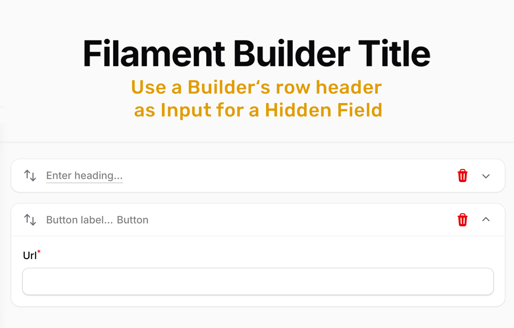

# Filament Builder Title

Editable title input directly in Filament **Builder block** and **Repeater row** headers. Instead of a static label, users can type a title right in the header bar.



## Requirements

- PHP 8.2+
- Filament v5

## Installation

```bash
composer require mmoollllee/filament-builder-title
```

## Usage

Add `->title()` to any Builder Block. The referenced field must exist as `Hidden::make()` in the block's schema:

```php
use Filament\Forms\Components\Builder\Block;
use Filament\Forms\Components\Hidden;
use Filament\Forms\Components\TextInput;

Block::make('section_header')
    ->schema([
        Hidden::make('heading'),
        TextInput::make('subheading'),
    ])
    ->title('heading', placeholder: 'Section Title', suffix: '– Header')
```

This renders an inline text input in the block header that writes directly to the `heading` field.

### Repeater rows

The same `->title()` macro works on `Filament\Forms\Components\Repeater`, replacing the read-only `->itemLabel()` with an editable input in each row header:

```php
use Filament\Forms\Components\Hidden;
use Filament\Forms\Components\Repeater;
use Filament\Forms\Components\TextInput;

Repeater::make('specs')
    ->schema([
        Hidden::make('label'),
        TextInput::make('value'),
    ])
    ->title('label', placeholder: 'Row label')
```

Signature and rules are identical to the Block macro (bind a `Hidden::make()` field; do not also set `->itemLabel()`).

> **Note:** the macro drives the row header label, so it only applies to the default Repeater layout. Filament's `->table()` and `->simple()` layouts don't render an item label, so `->title()` has no effect there — keep the field visible in the schema for those layouts instead.

### Parameters

```php
->title(
    field: 'heading',           // Required – field name to bind to
    placeholder: 'Enter title', // Optional – shown when empty (defaults to humanized block name)
    suffix: '– Header',         // Optional – static text after the input
)
```

| Parameter | Type | Default | Description |
|-----------|------|---------|-------------|
| `field` | `string` | — | The field name in the block schema to bind the input to. |
| `placeholder` | `?string` | Block name | Placeholder text when the input is empty. |
| `suffix` | `?string` | `null` | Static label displayed after the input. Clicking it focuses the input. |

### Important

- The `field` must be declared as `Hidden::make('field_name')` in the block's `->schema()`. Using `TextInput::make()->hidden()` will not work — Filament excludes hidden fields from state dehydration.
- `->title()` replaces `->label()`. Do not use both on the same block.

## Features

- **Inline editing** — Title is editable directly in the block header, even when collapsed or with enabled previews
- **Auto-resize** — Input width grows with its content (via `field-sizing: content` if supported)
- **Suffix label/Block Label** — Optional static text after the input (clickable, focuses input)
- **No view override** — Uses Filament's `Htmlable` label support, no Builder Blade override needed
- **Collapse-safe** — Click events are stopped so typing doesn't toggle block collapse

## How It Works

The package registers a `title()` macro on both `Filament\Forms\Components\Builder\Block` and `Filament\Forms\Components\Repeater` via Filament's `Macroable` trait.

The macro sets the header label (Block `->label()` / Repeater `->itemLabel()`) to a closure returning an `HtmlString` containing an `<input>` element. The input is bound to Livewire state via Alpine's `$wire.$entangle()`, which provides two-way data binding without triggering extra network requests. Both share the same `title-input` view and CSS.

The state path differs per component because their state shapes differ:

- **Builder** wraps each block as `{ type, data: {…} }`, so the path is `{builderStatePath}.{itemKey}.data.{field}`.
- **Repeater** rows are flat, so the row container's own state path already is `{repeaterStatePath}.{uuid}`, and the field is one level below: `{repeaterStatePath}.{uuid}.{field}` (no `.data.`).

## Local Development & Live-Demo

To test the plugin locally with a full Filament panel, the package includes an [Orchestra Testbench](https://packages.tools/testbench) workbench setup.

```bash
# Install dependencies
composer install

# Start the development server (runs migrations, seeds, and publishes assets automatically)
composer serve
```

Open [http://localhost:8000/login](http://localhost:8000/login) and log in with prefilled credentials.

The panel has three demo pages: "Builder Title Demo" (a Builder with `->title()` blocks), "Nested Builder Title Demo" with Block Previews and Nested Blocks and "Repeater Title Demo" (a Repeater with `->title()` rows).

### Running Tests

```bash
composer test
```

## Publishing Views

```bash
php artisan vendor:publish --tag=filament-builder-title-views
```

## License

MIT
